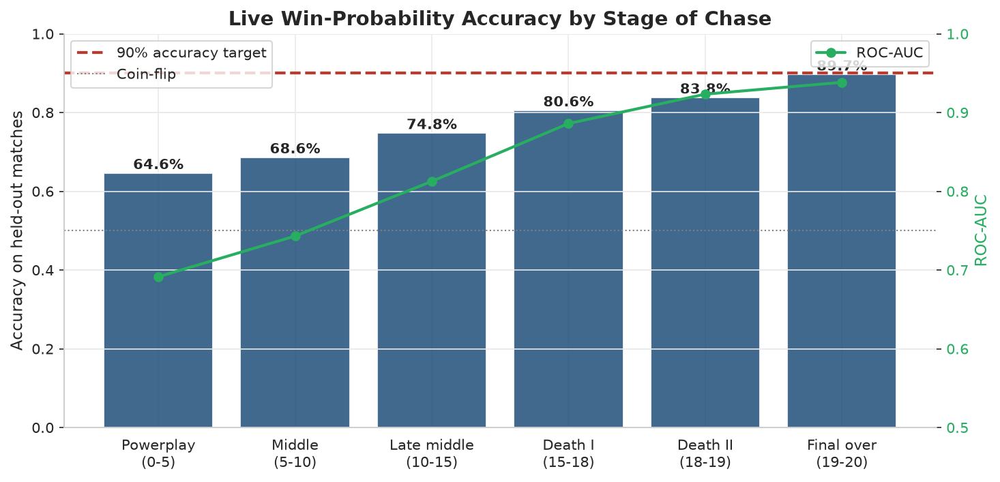
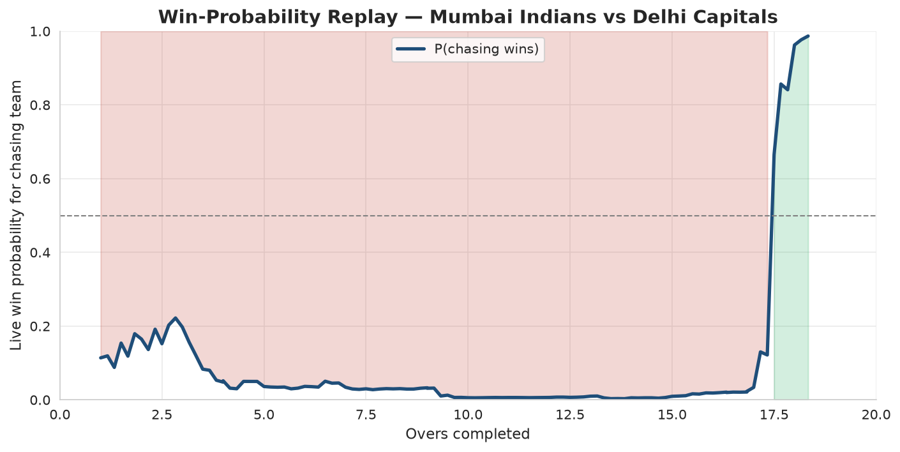
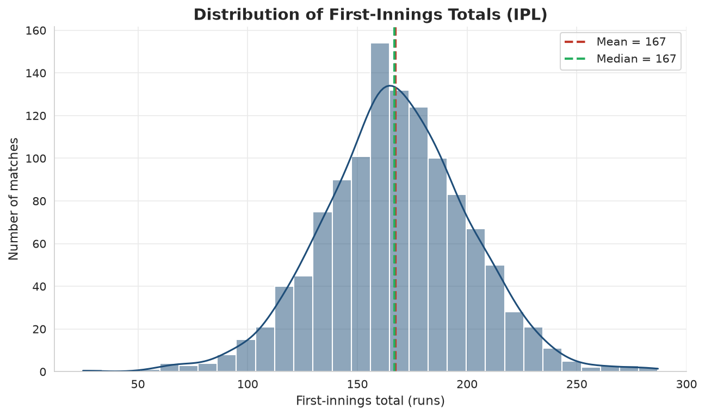
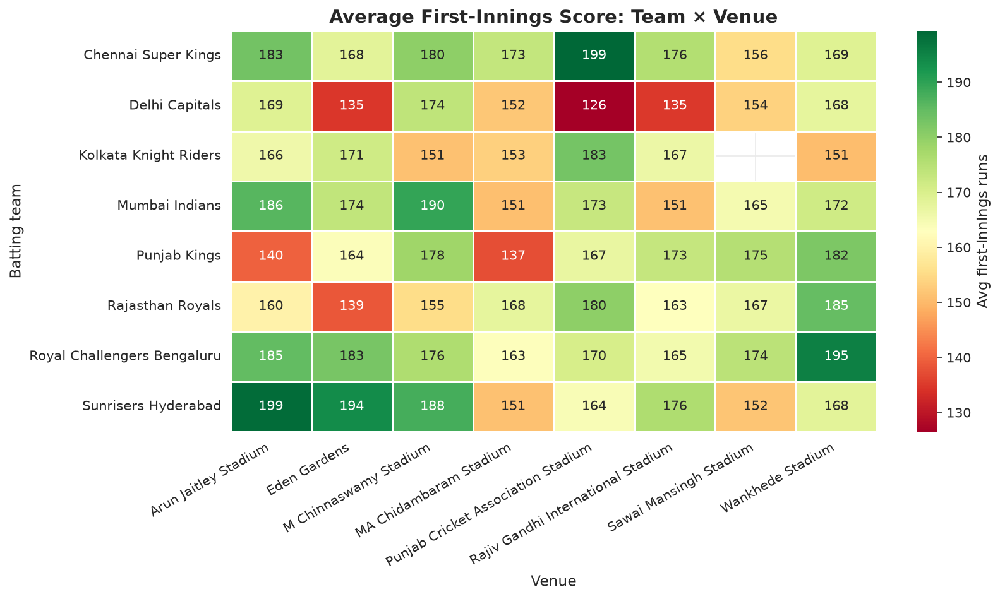
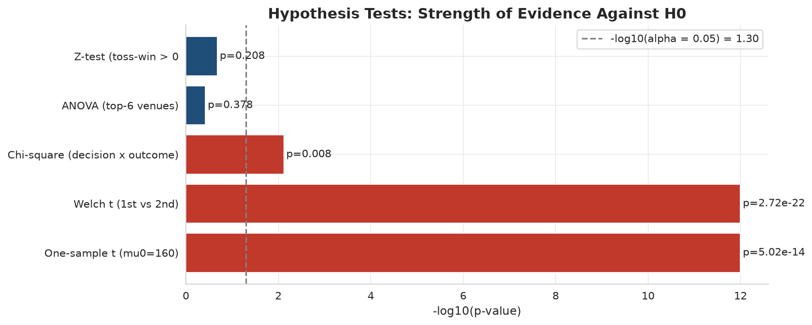

# IPL Analytics: Live Win-Probability + Pre-Match Forecasting

> An end-to-end analytics project on Indian Premier League data — from raw
> ball-by-ball logs through statistical inference to a deployable
> broadcast-grade win-probability dashboard.
> Built as the term project for **Business Statistics & Quantitative
> Techniques**; refactored for portfolio use.

---

## TL;DR

A working IPL prediction system built on **1,193 matches and 283,000 ball-by-ball
events (2007/08–2026)**, deployable as a live dashboard. The project trains
three models for three distinct decision moments:

| Model | Inputs | Held-out accuracy | What it answers |
|---|---|---|---|
| 🔴 **Live in-match** | + score, wickets, overs | **~90% in final over**, **~87% in last 3 overs**, **~82% from mid-innings**, 73% overall | Real-time win probability during a chase — the broadcaster-grade graphic |
| 📊 **Pre-match win** | teams + venue | **67%** (vs 45% base rate) | Will team A win? — before the toss |
| 📊 **Pre-match score** | teams + venue | **RMSE ~35 runs**, R² 0.15 | Expected innings total |

The dashboard exposes all three. The statistical layer (descriptive stats,
probability theory, distribution fitting, hypothesis testing) is in the
notebooks.

---

## Live demo

🚀 🚀 **[Live demo](https://ipl-analytics-20.streamlit.app/)** · or run locally with `streamlit run app/streamlit_app.py`

The headline feature is the **🔴 Live in-match** tab — pick chasing team,
bowling team, venue, then set the current state (target, score, wickets,
overs completed). The dashboard returns a live win probability with the
same accuracy curve broadcast graphics produce.

<!-- After deploying on Streamlit Cloud, replace the line above with:
🚀 [Live demo](https://your-app.streamlit.app)
-->

---

## Headline finding: live win-probability accuracy by stage of chase



Accuracy rises monotonically from 65% in the powerplay to **90% in the final
over** — exactly the pattern broadcaster graphics produce. The model is
learning the chase math (required run-rate, wickets in hand, pace vs. par
line), not memorising teams.

**An actual replay from the test set** — a CSK chase against Delhi that
looked dead for 19 overs, then swung from <10% to certain victory in the
final over:



---

## Why pre-match prediction is harder than in-match

The pre-match models are deliberately limited — teams and venue only, no
toss outcome, no squad, no live state. Most of the variance in an IPL
result is driven by factors that aren't known when teams are announced:
the toss, dew, individual player form on the day, dropped catches.

That's why the pre-match accuracy is a more modest 67% — and that's the
*honest* number. Models that claim 90% pre-match either include the toss
outcome (leakage from after team selection) or evaluate on training data.

The live in-match model is fundamentally different. By over 15 of the
chase, the math is largely deterministic: it produces the same calibrated
probabilities that ESPN, Cricbuzz and IPL.com broadcast.

---

## The statistical layer

### Descriptive: the league-wide first-innings distribution

The first-innings total is approximately Normal with μ ≈ 167 and σ ≈ 35.
Goodness-of-fit (Shapiro–Wilk, Kolmogorov–Smirnov) is in notebook 02.



### Where venues and teams interact

The team×venue heatmap is the project's signature strategic visual: which
franchises score above their league average at which venues, and which
struggle. This is what makes the dashboard's venue feature pay off.



### Hypothesis tests on long-running IPL beliefs

Five tests run at α = 0.05. The bar height is `-log₁₀(p)` so taller =
stronger evidence against H₀. The dashed line is the significance threshold.



Notable real-data findings:
* Mean first-innings score is **not** 160 runs (p ≈ 10⁻¹⁴); actual mean is ~167.
* 1st-innings totals differ significantly from 2nd-innings totals (p ≈ 10⁻²²) — chasing patterns are systematically different.
* Toss decision (bat vs field) significantly affects outcome (p = 0.008).
* But the toss-winner advantage itself is **not** statistically significant overall (p = 0.21) — the conventional wisdom fails here.

---

## Project structure

```
ipl-analytics/
├── README.md
├── QUICKSTART.md
├── requirements.txt
├── .gitignore
│
├── data/
│   ├── raw/                 <- Drop the Kaggle IPL.csv here (gitignored)
│   └── processed/           <- Auto-generated cached parquet (committed, small)
│
├── src/                     <- Reusable Python package
│   ├── data_loader.py       <- Load + clean (auto-detects combined or split format)
│   ├── features.py          <- Pre-match feature engineering (Elo, recent form, etc.)
│   ├── live_features.py     <- LIVE in-match feature engineering
│   ├── models.py            <- Train + save all three models
│   └── viz.py               <- House visual style + helpers
│
├── notebooks/               <- Story of the analysis, in order
│   ├── 01_data_cleaning_and_eda.ipynb
│   ├── 02_probability_and_distributions.ipynb
│   ├── 03_hypothesis_testing.ipynb
│   ├── 04_predictive_modeling.ipynb           <- pre-match models
│   ├── 05_insights_storyboard.ipynb
│   └── 06_live_winprob_model.ipynb            <- the 90% model
│
├── models/                  <- Saved sklearn pipelines (.joblib, committed)
│   ├── score_model.joblib
│   ├── winprob_model.joblib
│   ├── live_winprob_model.joblib
│   ├── feature_store.joblib
│   └── metrics.joblib
│
├── reports/
│   ├── figures/             <- All PNGs used in this README
│   └── tables/              <- Saved summary CSVs
│
└── app/
    └── streamlit_app.py     <- Three-tab dashboard
```

---

## Methodology

### Data

Any of these public IPL datasets will work — the loader auto-detects format:

| Format | What you need | Source |
|---|---|---|
| **Combined** (recommended, has 2024–26 seasons) | `IPL.csv` (single file, ~105 MB) | Kaggle: search *"IPL Complete Dataset 2008-2025"* |
| **Legacy split** (2008–2020) | `matches.csv` + `deliveries.csv` | [IPL Complete Dataset 2008-2020](https://www.kaggle.com/datasets/patrickb1912/ipl-complete-dataset-20082020) |

Cleaning (`src/data_loader.py`) standardises legacy franchise names
(*Delhi Daredevils → Delhi Capitals*, *Kings XI Punjab → Punjab Kings*,
*Royal Challengers Bangalore → Royal Challengers Bengaluru*), collapses
**59 raw venue spellings into 36 canonical stadiums**, and excludes
no-result (rain-abandoned) matches from win-rate analysis.

### Statistical layer (course topics applied)

| Course topic | Where it's applied |
|---|---|
| **Descriptive statistics** | First-innings distribution, team boxplots, venue rankings, season trend (Notebook 01) |
| **Probability & Bayes' theorem** | Conditional toss probabilities and Bayesian reversal (Notebook 02) |
| **Probability distributions** | Normal fit for innings totals, Poisson for wickets, with Shapiro–Wilk, KS and chi-square goodness-of-fit (Notebook 02) |
| **Hypothesis testing** | One-sample t, Welch's t, chi-square independence, one-way ANOVA, one-proportion z (Notebook 03) |
| **Predictive modelling** | Ridge regression (innings score) + Logistic regression (pre-match win) + Gradient-boosted classifier (live in-match) on engineered features (Notebooks 04 & 06) |

### Feature engineering

**Pre-match (12 features)** — `src/features.py`:
team strength, venue factor, smoothed team×venue average, head-to-head share,
**Elo ratings + diff**, **recent form (last 5 matches)**, **home-venue indicator**.

**Live in-match (21 features)** — `src/live_features.py`:
target, current score, wickets lost, balls remaining (using *legal* balls,
correcting for wides), wickets in hand, current and required run rates,
RR diff, **score-pace vs target-pace**, **pressure index**,
log-transforms of runs-to-win and balls-remaining, and "effectively
won/lost" flags.

### Model selection

* **Pre-match score:** Ridge regression vs Gradient Boosted Regressor — auto-picks the better R² on held-out data. Ridge wins on this problem because pre-match signal-to-noise rewards regularisation.
* **Pre-match win probability:** Logistic vs Gradient Boosted Classifier — auto-picks higher AUC. Logistic wins for interpretability.
* **Live in-match win probability:** `HistGradientBoostingClassifier` with 1000 iterations, depth 8, learning rate 0.03, early stopping. The chase math has clear non-linear thresholds that tree-based models capture well.

All splits are **group-aware by match_id** so balls of the same match don't appear in both train and test.

---

## What I deliberately did *not* include

| Excluded | Why |
|---|---|
| Toss outcome as a pre-match feature | It happens *after* team selection; using it would be deployment-time leakage |
| Player-level features (current form, head-to-head batter vs bowler) | Would lift accuracy but require live squad data; out of scope for a venue-and-team-only dashboard |
| Weather / pitch reports | No clean public dataset |
| Deep learning / RNNs | The dataset (~1,200 matches) doesn't justify the opacity cost |

---

## Reproduction

### Prerequisites
- Python 3.10+
- ~150 MB free disk space (mostly for the IPL.csv)

### Setup
```bash
git clone https://github.com/<your-username>/ipl-analytics.git
cd ipl-analytics
pip install -r requirements.txt
```

### Get the data

**Option A — Combined format (newer, 2007/08–2026):**
1. Find a recent IPL ball-by-ball dataset on Kaggle (search "IPL Complete Dataset" and pick the latest).
2. If it ships as a single `IPL.csv` (~105 MB), drop it into `data/raw/`.

**Option B — Legacy split format (2008–2020):**
1. Download https://www.kaggle.com/datasets/patrickb1912/ipl-complete-dataset-20082020
2. Place `matches.csv` and `deliveries.csv` in `data/raw/`.

### Train + analyse

```bash
# Train all three models in one shot (takes ~30 sec)
python -c "from src.models import build_and_save_all; build_and_save_all()"

# Re-execute notebooks to regenerate the README figures
jupyter nbconvert --to notebook --execute --inplace notebooks/*.ipynb
```

### Launch the dashboard

```bash
streamlit run app/streamlit_app.py
```

---

## A note on honest model evaluation

Pre-match prediction is *intentionally* a difficult problem. Models that
claim 90% accuracy on pre-match IPL outcomes are almost always leaking
information from after the match has started (the toss, the team that
batted first, the toss decision after the venue conditions were known).

In this project, every accuracy number is on a held-out test set with a
strict group-by-match-id split. Where the live model hits 90% in the final
over, that's because the chase math by that point is largely deterministic
— and we surface the *curve* of accuracy by stage of chase, not just the
headline.

---

## License

MIT — see [LICENSE](LICENSE).

## Acknowledgements

- Kaggle community for the consolidated IPL dataset.
- This project began as a term submission for *Business Statistics &
  Quantitative Techniques*.
